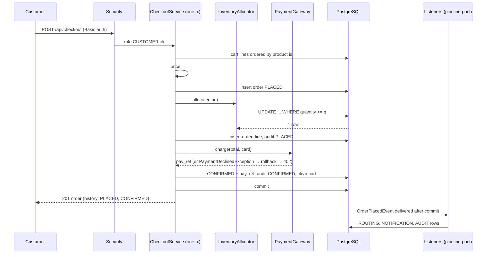
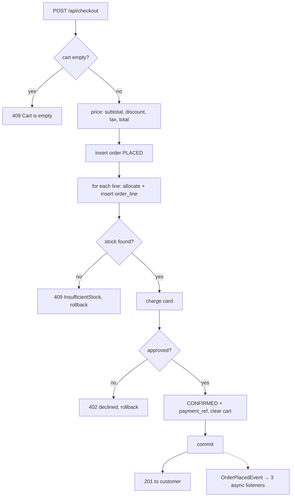

# E-commerce Order Management

A Spring Boot service for an online shop: multi-category catalog, per-customer cart, checkout with
discounts and tax, inventory across multiple warehouses, payment, the fulfillment lifecycle
(placed → confirmed → packed → shipped → delivered → returned), and returns with refunds. Three roles:
admin, customer, warehouse staff.

Three requirements from the brief were treated as the core and are provably correct:

1. **No overselling under concurrent purchases, across warehouses.** Stock is taken with one atomic
   conditional `UPDATE ... WHERE quantity >= :q`; PostgreSQL's row lock plus predicate re-evaluation
   means two buyers can never both take the last unit. Proven by fifty-thread tests.
2. **Checkout is atomic across cart, inventory and payment.** One database transaction; a declined card
   or missing stock rolls everything back and leaves no trace.
3. **The downstream pipeline does not block the checkout response.** Fulfillment routing, customer
   notification and audit logging run as after-commit, asynchronous listeners on a bounded pool.

**Demo video:** _link to be added_

## Run it

Prerequisite: a JDK 21. Nothing else. A real PostgreSQL 17 runs embedded inside the JVM.

```bash
export JAVA_HOME=$(/usr/libexec/java_home -v 21)   # macOS; any JDK 21 works
./mvnw spring-boot:run                              # http://localhost:8080
```

Every start is a fresh, seeded database:

| Seed | Values |
|---|---|
| Products | 1 Wireless Headphones 99.99 · 2 Mechanical Keyboard 79.50 · 3 Designing Data-Intensive Applications 45.00 |
| Warehouses | 1 WH-EAST · 2 WH-WEST |
| Headphone stock | 6 in WH-EAST, 4 in WH-WEST (10 total; used by the concurrency tests) |
| Discount | `SAVE10` = 10% off |
| Users (HTTP Basic) | `admin` / `admin123` · `customer` / `customer123` · `staff` / `staff123` |

To use an external PostgreSQL instead:
`SPRING_PROFILES_ACTIVE=postgres DB_URL=jdbc:postgresql://host:5432/db DB_USER=... DB_PASSWORD=... ./mvnw spring-boot:run`

## Test it

```bash
./mvnw verify          # 119 tests: unit, integration on embedded PostgreSQL, 50-thread concurrency proofs
./mvnw test -Pdemo     # four stock-taking strategies raced side by side; the naive one oversells
```

The demo prints a table like this:

```
naive read-check-write                  buyers=50 units=6 sold=50 left=1  round-trips=2 retries=0   -> OVERSOLD by 44
pessimistic SELECT FOR UPDATE           buyers=50 units=6 sold=6  left=0  round-trips=2 retries=0   -> correct
optimistic compare-and-retry            buyers=50 units=6 sold=6  left=0  round-trips=2 retries=10  -> correct
atomic conditional UPDATE (production)  buyers=50 units=6 sold=6  left=0  round-trips=1 retries=0   -> correct
```

A Postman collection with all endpoints, happy and failure paths, in walkthrough order is at
`docs/postman/ecommerce-order-management.postman_collection.json`. Import it, start the app fresh, and run
the folders top to bottom; each folder carries its role's credentials.

## API

| Method | Path | Role | Notes |
|---|---|---|---|
| GET | `/api/categories` | public | |
| GET | `/api/products?categoryId=` | public | optional category filter |
| GET | `/api/products/{id}` | public | |
| POST | `/api/admin/categories` | admin | `{"name"}` |
| POST | `/api/admin/products` | admin | `{"sku","name","price","categoryId"}`; duplicate SKU → 409 |
| POST / GET | `/api/admin/warehouses` | admin | `{"name"}` |
| PUT / GET | `/api/admin/inventory` | admin | `{"productId","warehouseId","quantity"}`; upsert; `?productId=` filter on GET |
| POST / GET | `/api/admin/discounts` | admin | `{"code","percentOff"}` |
| POST | `/api/cart/items` | customer | `{"productId","quantity"}`; same product increments |
| GET | `/api/cart?discountCode=` | customer | priced exactly as checkout will price it |
| POST | `/api/checkout` | customer | `{"cardNumber","discountCode"?}`; card ending `0002` is declined → 402 |
| GET | `/api/orders`, `/api/orders/{id}` | customer / staff / admin | customers see their own; a stranger's order is 404 |
| PATCH | `/api/fulfillment/orders/{id}/status` | staff | `{"status"}` ∈ PACKED, SHIPPED, DELIVERED; illegal move → 409 listing legal ones |
| POST | `/api/orders/{id}/return` | customer | from DELIVERED only; full refund, restock to origin warehouse |

Errors are RFC 7807 `ProblemDetail`: 400 validation, 401 no credentials, 402 payment declined, 403 wrong
role, 404 not found or not yours, 409 conflict with current state.

## How it is built

Java 21, Spring Boot 4.1.1, Maven wrapper. Spring Web MVC, Spring Security (HTTP Basic), Bean Validation.
Data access is `JdbcClient` with hand-written SQL built from a shared vocabulary of table, column and
parameter names (`common/Db`, `common/Params`); no ORM. Flyway owns the schema, with the invariants in the
database: unique constraints, `check (quantity >= 0)`, foreign keys, money as `numeric(12,2)`.
PostgreSQL 17 runs embedded via Zonky under the default `local` profile.

Package by feature: `catalog`, `inventory`, `discount`, `cart`, `pricing`, `payment`, `order`, `pipeline`,
plus `config` and `common`. Controllers translate HTTP; services own use cases and transactions;
repositories own SQL.

The full design, requirements, assumptions, component walkthrough and the list of deliberate
scoping cuts are in [`docs/plan.md`](docs/plan.md). The assignment as received is in
[`docs/brief.md`](docs/brief.md).

### Class diagram

`CheckoutService` is the orchestrator: it owns the transaction and delegates allocation, pricing, payment
and legality checks to the components that own those concerns.

```mermaid
classDiagram
    class OrderStatus {
        <<enumeration>>
        PLACED
        CONFIRMED
        PACKED
        SHIPPED
        DELIVERED
        RETURNED
    }
    class AuditType {
        <<enumeration>>
        STATUS
        ROUTING
        NOTIFICATION
        AUDIT
    }
    class PaymentGateway {
        <<interface>>
        +charge(amount, cardNumber) String
        +refund(paymentRef, amount) String
    }
    class FakePaymentGateway {
        +DECLINED_SUFFIX = "0002"
    }
    class OrderStateMachine {
        -ALLOWED Map~OrderStatus, Set~
        +allowedTransitions(from) Set
        +canTransition(from, to) boolean
        +assertCanTransition(from, to)
    }
    class InventoryAllocator {
        +allocate(productId, quantity) long
    }
    class InventoryRepository {
        +findWarehousesWithStock(productId, qty) List
        +tryDecrement(productId, warehouseId, qty) boolean
        +restock(productId, warehouseId, qty)
        +upsert(productId, warehouseId, qty) Inventory
    }
    class PricingService {
        -taxRate BigDecimal
        +price(lines, percentOff) PriceBreakdown
    }
    class CheckoutService {
        +checkout(customer, request) OrderResponse
    }
    class FulfillmentService {
        -STAFF_TARGETS Set
        +updateStatus(orderId, target) OrderResponse
    }
    class ReturnService {
        +returnOrder(customer, orderId) OrderResponse
    }
    class OrderService {
        +getOrder(id) OrderResponse
        +getOrderForCustomer(customer, id) OrderResponse
    }
    class OrderPlacedEvent {
        <<record>>
        orderId, customer, total, warehouseIds
    }
    class RoutingListener
    class NotificationListener
    class AuditListener
    class ApiExceptionHandler {
        +handle*(exception) ProblemDetail
    }

    PaymentGateway <|.. FakePaymentGateway
    CheckoutService --> InventoryAllocator : allocates lines
    CheckoutService --> PricingService : prices cart
    CheckoutService --> PaymentGateway : charges
    CheckoutService --> OrderStateMachine : PLACED to CONFIRMED
    CheckoutService --> OrderPlacedEvent : publishes after commit
    InventoryAllocator --> InventoryRepository : tryDecrement
    FulfillmentService --> OrderStateMachine : legal moves
    ReturnService --> OrderStateMachine : DELIVERED to RETURNED
    ReturnService --> PaymentGateway : refunds
    ReturnService --> InventoryRepository : restocks
    OrderPlacedEvent <.. RoutingListener : AFTER_COMMIT
    OrderPlacedEvent <.. NotificationListener : AFTER_COMMIT
    OrderPlacedEvent <.. AuditListener : AFTER_COMMIT
    OrderStateMachine --> OrderStatus
```



### Checkout sequence

Everything between "cart lines" and "commit" is one database transaction. The customer's response goes
out on commit; the three listeners run afterwards on their own thread pool.



### Checkout decision flow

Every branch to the right of a failure ends in a rollback, so a failed checkout leaves no order, no
missing stock and a full cart.



## Assumptions

- Single process, embedded database, no message brokers, per the brief's out-of-scope list.
- Three in-memory users stand in for authentication; the username is the customer identity.
- Payment is an in-process fake following the test-card convention (a card ending `0002` is declined).
  Because it is instant and local, checkout runs as one transaction. With a real provider the flow would
  be reserve → charge outside the transaction → confirm or release.
- Each order line ships from one warehouse, the fullest that can cover it. No split shipments.
- One percentage discount per order; flat 10% tax on the discounted amount; no shipping fee.
- Returns are whole-order, from DELIVERED only, auto-approved, full refund, restock to origin warehouse.
- Pipeline events live in the JVM between commit and delivery; one in flight when the process dies is
  lost. The production fix is a transactional outbox table.
- Admin endpoints are create-only; any staff member may update any order; list endpoints are not paginated.

## AI-assisted development

The project was built with an AI coding agent working under [`AGENTS.md`](AGENTS.md), which was written
before the first line of application code and updated as the work progressed. It holds the hard
constraints (no ORM, no brokers, `BigDecimal` for money, no network I/O inside a transaction, atomic
conditional updates for stock), the conventions, the commit plan with its status, and the notes on what
went wrong along the way. The human reviewed every commit and performed every push.

**Skills used:** none. No custom agent skills or skill files were used; the agent's behaviour was steered
entirely by `AGENTS.md` and the plan in `docs/plan.md`.

**Raw files used during development**, all under `docs/`:

- `docs/brief.md`: the assignment text as received
- `docs/plan.md`: the implementation plan agreed before coding, including requirements, assumptions,
  component design and the commit plan
- `docs/postman/ecommerce-order-management.postman_collection.json`: the request collection used to
  exercise every endpoint by hand
